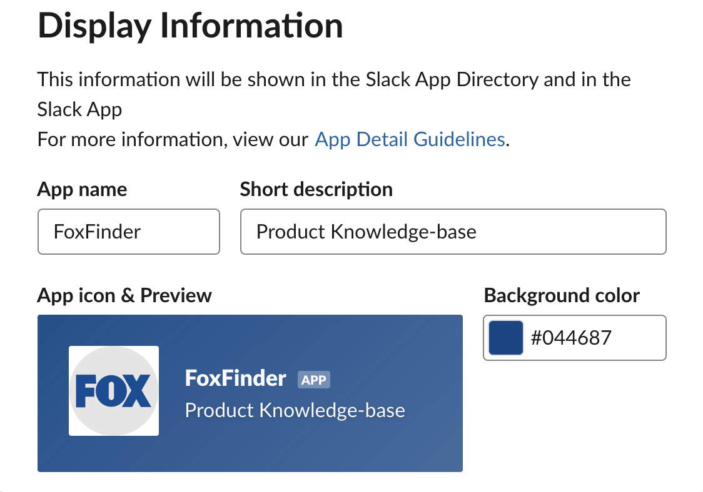
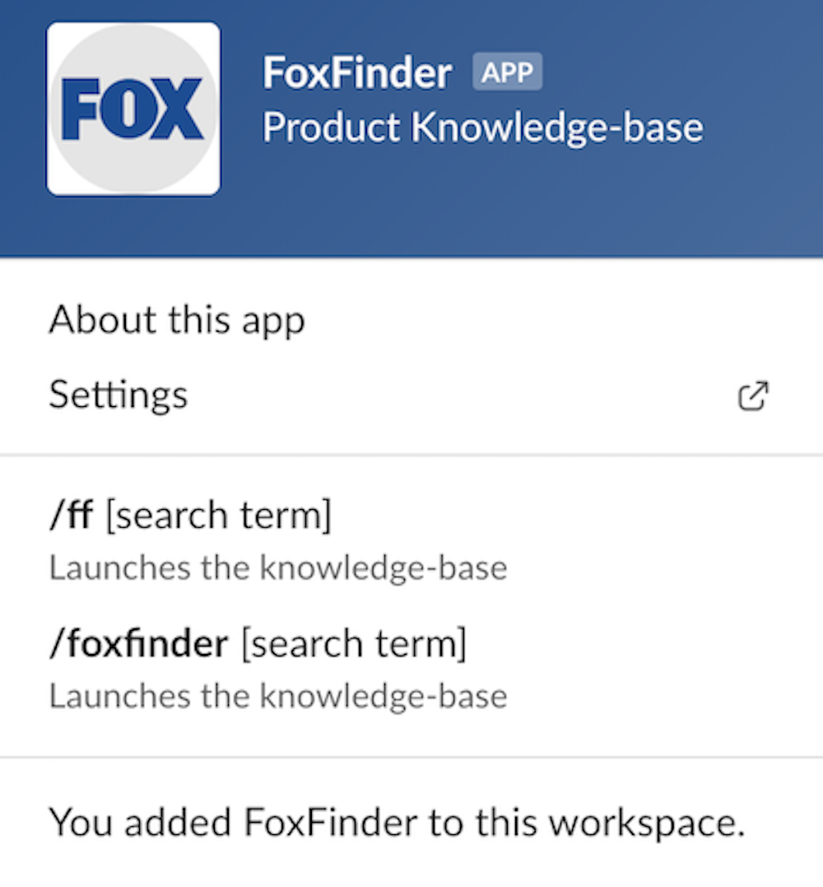
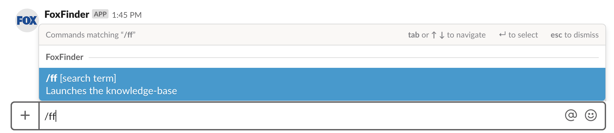
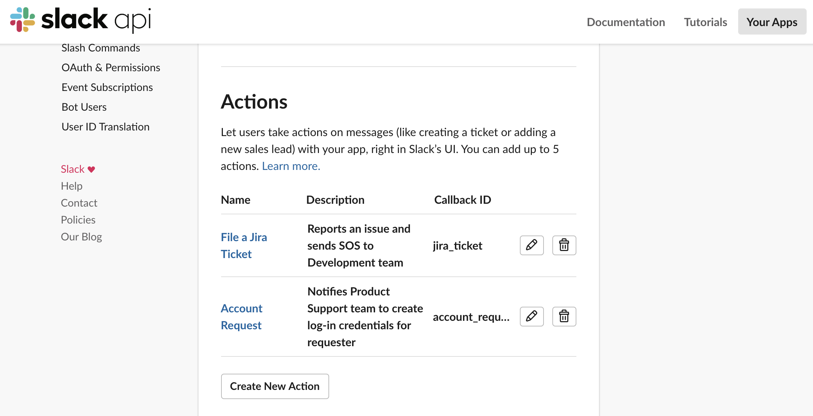
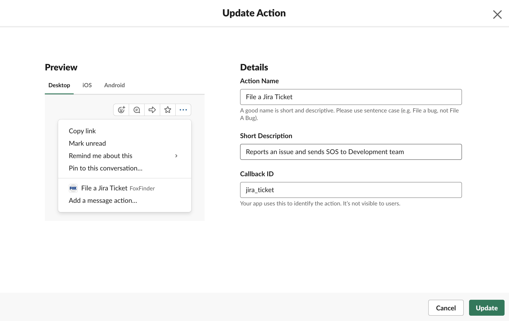
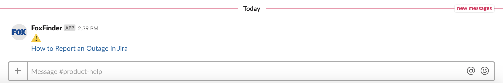
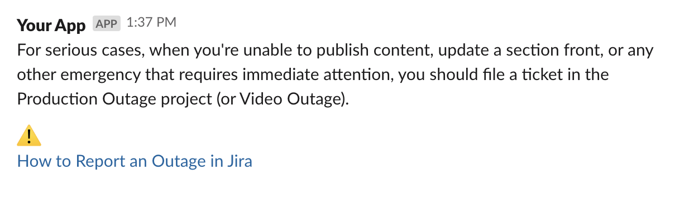

 

# FoxFinder 
Slack App Proof of Concept (POC) presented and accepted by my Product Management team at Fox Corporation.

Adapted from https://github.com/johnagan/serverless-slackbot 📣

# App in Action

**CloudApp video link:**

https://cl.ly/2fc360b0d5bb

# Proof of Concept

**What:** To create a *quick and efficient way* for Editorial to access the Product-Support *knowledge-base stored in Quip*. 
**How**: Via Slack slash commands

**Desired Functionality:**

1. User should type a variation of Slack slash command + (keyword).
2. Bot should respond with pretext and Quip URL. 
3. When user clicks Quip URL, link should open up in browser.

___

**Proposed app name:**

*FoxFinder*

*Logo and color code to be determined

**Slash commands:**

1. /FoxFinder + (keyword) -- longform
2. /ff+ (keyword) -- shorthand

**Sample actions which can be included:**

1. Filing an Outage Ticket (example only, not advised)
2. Account Requests (sample action that could be taken in app)

**Sample Frontend:**

✌️

